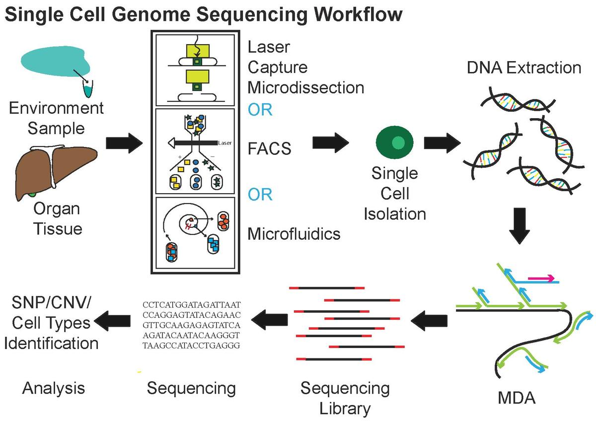
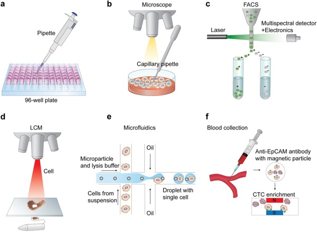
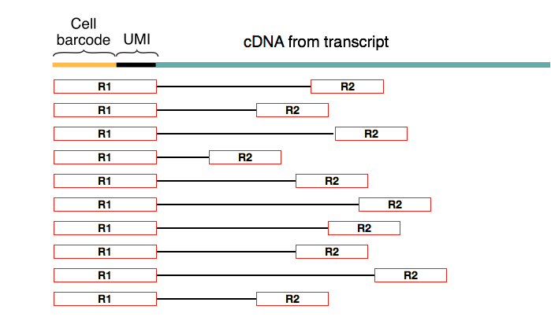
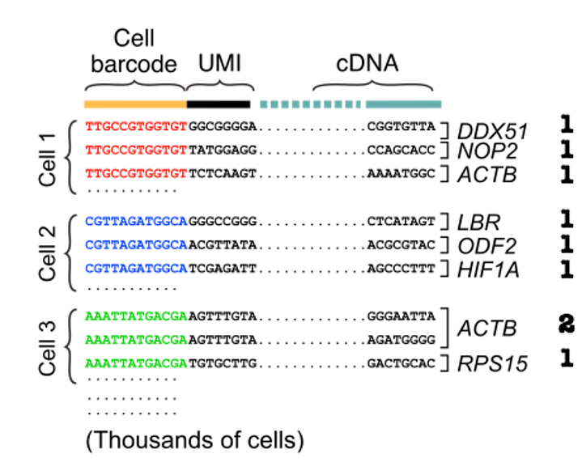

# Background Knowledge {#background}

## Single cell RNA sequencing(scRNA-seq)

Single cell RNA sequencing(scRNA-seq) is a sequencing technology which can give us gene expression profile of more than 30,000 genes for more than 10,000 cells.

Starting from tissue samples we get, we will get the analysis results after following processes.

<br/>

```{r workflow, fig.cap='Single Cell Genome Sequencing Workflow(taken from Wiki). MDA: multiple displacement amplification', out.width='80%', fig.align='center', echo=FALSE}

```

<br/>

## Cell isolation

Droplet-based:

* tissue sample must be dissociated into suspension

* cells will be encapsulated into a water-in-oildroplet individually

* high-through and low cost

* related technologies: Drop-seq[@macosko2015highly], inDrop[@klein2015droplet], Chromium 10X[@zheng2017massively]

<br/>

Non droplet-based:

* Smart-seq2[@ramskold2012full]: manual cell picking with micro capillary pipettes

* CEL-seq[@hashimshony2012cel]: individual cells are added to tubes; the first one introducing barcodes and pooling of RNA

* MARS-seq[@jaitin2014massively] is the first one using FACS to isolate single cells into individual wells, and the optimized version MARS-seq2[@keren2019mars] came out with lower cost, improved reproducibility, reduced well-to-well contamination

<br/>

Following shows some common single cell isolaion techniques[@hwang2018single].

```{r seq-techs, fig.cap='Single Cell Isolation', out.width='80%', fig.align='center', echo=FALSE}

```

For more information about different cell isolation techniques: [@hu2016single]

## Barcodes and Unique molecular identifiers(UMI)^[This part is modified from http://data-science-sequencing.github.io/Win2018/lectures/lecture16/]

The sequencing step is done using paired-end reads where the first read of the pair always coincides with the cell (barcode + UMI) part of the primer.

```{r biasedreads, fig.cap='Biased paired-end reads', out.width='80%', fig.align='center', echo=FALSE}

```

Based on the obtained reads consisting of cell barcode, UMI and cDNA, we can estimate the transcript abundances. It is important to recognised the library preparation chemistry used for sequencing in order to determine cell barcode and UMI barcode sequence length and location. This allows the mapping algorithm to distinguish which sequences are barcodes and which are transcript sequences.

We first group reads by cell barcode before aligning cDNA reads and counting unique molecules per cell per gene using the UMIs.

```{r biasedreads2, fig.cap='Biased paired-end reads', out.width='70%', fig.align='center', echo=FALSE}

```

This is the alignment process which we will introduce more in Chapter \@ref(raw2matrix).

## Summary of widely used scRNA-seq technologies

Following is a summary table from [@chen2019single]. It shows different features of widely used scRNA-seq technologies.

+-------------+-------------------+--------------+----------+-----------------------------+
| Methods     | Transcript        | UMI          | Strand   | References                  |    
|             | coverage          | possibility  | specific |                             |
+=============+===================+==============+==========+=============================+
| Tang method | Nearly full-length| No           | No       | [@tang2009mrna]             |
+-------------+-------------------+--------------+----------+-----------------------------+
| Quartz-Seq  | Full-length	      | No           | No       | [@sasagawa2013quartz]       |
+-------------+-------------------+--------------+----------+-----------------------------+
| SUPeR-seq   | Full-length	      | No           | No       | [@fan2015single]            |
+-------------+-------------------+--------------+----------+-----------------------------+
| Smart-seq   | Full-length       | No           | No       | [@ramskold2012full]         |
+-------------+-------------------+--------------+----------+-----------------------------+
| Smart-seq2  | Full-length       | No           | No       | [@picelli2013smart]         |
+-------------+-------------------+--------------+----------+-----------------------------+
| MATQ-seq    | Full-length       | Yes          | Yes      | [@sheng2017effective]       |
+-------------+-------------------+--------------+----------+-----------------------------+
| STRT-seq    | 5′-only           | Yes          | Yes      | [@islam2011characterization]|
| STRT/C1     |                   |              |          |                             |
+-------------+-------------------+--------------+----------+-----------------------------+
| CEL-seq     | 3′-only           | Yes          | Yes      | [@hashimshony2012cel]       |
+-------------+-------------------+--------------+----------+-----------------------------+
| CEL-seq2    | 3′-only           | Yes          | Yes      | [@hashimshony2016cel]       |
+-------------+-------------------+--------------+----------+-----------------------------+
| MARS-seq    | 3′-only           | Yes          | Yes      | [@jaitin2014massively]      |
+-------------+-------------------+--------------+----------+-----------------------------+
| CytoSeq     | 3′-only           | Yes          | Yes      | [@fan2015combinatorial]     |
+-------------+-------------------+--------------+----------+-----------------------------+
| Drop-seq    | 3′-only           | Yes          | Yes      | [@macosko2015highly]        |
+-------------+-------------------+--------------+----------+-----------------------------+
| InDrop      | 3′-only           | Yes          | Yes      | [@klein2015droplet]         |
+-------------+-------------------+--------------+----------+-----------------------------+
| Chromium    | 3′-only           | Yes          | Yes      | [@zheng2017massively]       |
+-------------+-------------------+--------------+----------+-----------------------------+
| SPLiT-seq   | 3′-only           | Yes          | Yes      | [@rosenberg2018single]      |
+-------------+-------------------+--------------+----------+-----------------------------+
| sci-RNA-seq | 3′-only           | Yes          | Yes      | [@cao2017comprehensive]     |
+-------------+-------------------+--------------+----------+-----------------------------+
| Seq-Well    | 3′-only           | Yes          | Yes      | [@gierahn2017seq]           |
+-------------+-------------------+--------------+----------+-----------------------------+
| DroNC-seq   | 3′-only           | Yes          | Yes      | [@habib2017massively]       |
+-------------+-------------------+--------------+----------+-----------------------------+
| Quartz-Seq2 | 3′-only           | Yes          | Yes      | [@sasagawa2018quartz]       |
+-------------+-------------------+--------------+----------+-----------------------------+


