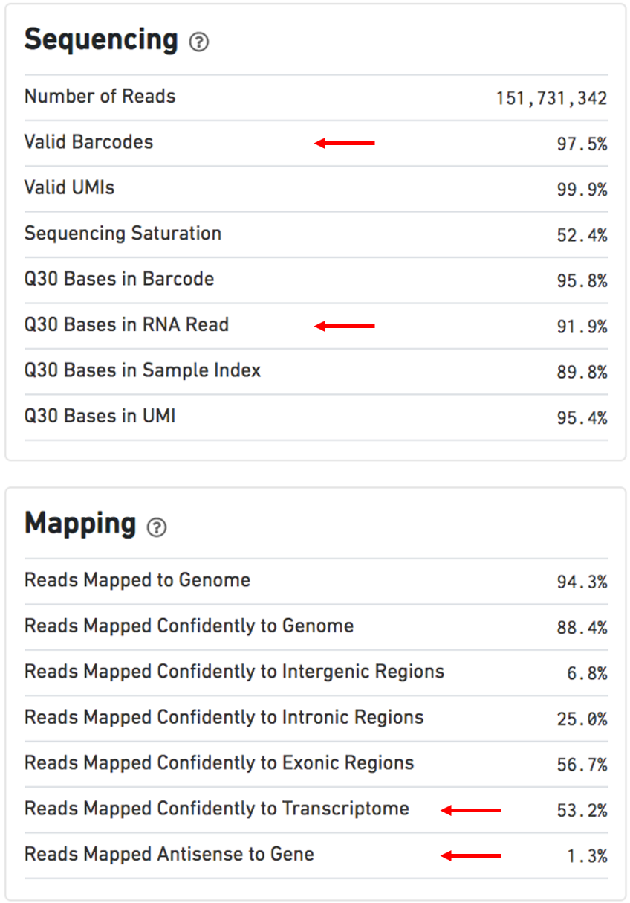

# Pre-processing and QC {#raw2matrix}

## FASTQ file

Raw RNA-sequencing data might be in a fastq file. It is a text-based format used for storing read sequences represented by single-letter codes. A sequence in FASTA format begins with a readID started with ("@") symbol, then lines of sequence data, a separator which is simply a plus (+) sign, and the base call quality scores. It is represented in the following format:

```
>ReadID
READ SEQUENCE
+
SEQUENCING QUALITY SCORES
```

For more details about FASTQ files: https://sapac.support.illumina.com/bulletins/2016/04/fastq-files-explained.html

Generally fastq files are pre-processed using quality control tools, such as [FastQC](https://www.bioinformatics.babraham.ac.uk/projects/fastqc/). This outputs a series of metrics assessing the quality of sequence reads. Some of these metrics include:
```
1. Per base sequence quality
2. Per sequence quality scores
3. Per base sequence content
4. Per sequence GC content
5. Per base N content
6. Sequence Duplication Levels
7. Overrepresented Sequences
8. Adapter Content
9. Kmer Content
```

For more details about FastQC: https://www.bioinformatics.babraham.ac.uk/projects/fastqc/

## Cell Ranger^[For more information:  https://support.10xgenomics.com/single-cell-gene-expression/software/pipelines/latest/what-is-cell-ranger]

Figures and contents in this sub-chapter are modified from [Cell Ranger Support Pages](https://support.10xgenomics.com/single-cell-gene-expression/software/pipelines/latest/what-is-cell-ranger). 

[Cell Ranger](https://support.10xgenomics.com/single-cell-gene-expression/software/pipelines/latest/what-is-cell-ranger) is a set of analysis pipelines that process Chromium single-cell data to align reads, generate feature-barcode matrices, perform clustering and other secondary analysis, and more.

Some concepts:

* **GEM well** (formerly **GEM group**): A set of partitioned cells (Gelbeads-in-Emulsion) from a single 10x Chromium™ Chip channel. One or more sequencing **libraries** can be derived from a **GEM well**.

* **Library** (or **Sequencing Library**): A 10x-barcoded sequencing library prepared from a single **GEM well**. With Feature Barcode or V(D)J assays, it is possible to create multiple libraries from the same **GEM well**. The library types may include Gene Expression, Antibody Capture, CRISPR Guide Capture, TCR-enrichment, etc.

* **Sequencing Run** (or **Flowcell**): A flowcell containing data from one sequencing instrument run.

### General workflow

Single-cell data getting from Chromium 10X pipeline can be processed through following workflow using cellranger.

```{r cellranger, fig.cap='Cellranger Workflow(taken from the cellranger website)', out.width='100%', fig.align='center', echo=FALSE}
knitr::include_graphics('./figs/cellranger_workflow.png')
```

### Output file^[For more information: https://support.10xgenomics.com/single-cell-gene-expression/software/pipelines/latest/output/overview]

Following the output folder we will get from cellranger. The `outs` folder contains the final pipeline output files which including what we want for downstream analysis.

```{r cellranger2, fig.cap='Overview of the folder generate from cellranger', out.width='100%', fig.align='center', echo=FALSE}

```

```{r cellranger3, fig.cap='Overview of the outs folder', out.width='90%', fig.align='center', echo=FALSE}
knitr::include_graphics('./figs/cellranger_output2.png')
```

Above is what we can find in the `outs` folder. It contains some summary information of the sequencing data, the annotated read sequences, and gene expression matrices we commonly work on. Following is some important output files we want to look at.

* [Matrices](https://support.10xgenomics.com/single-cell-gene-expression/software/pipelines/latest/output/matrices)
* [Web Summary .html](https://support.10xgenomics.com/single-cell-gene-expression/software/pipelines/latest/output/summary)
* [Secondary Analysis CSV](https://support.10xgenomics.com/single-cell-gene-expression/software/pipelines/latest/output/analysis)
* [BAM](https://support.10xgenomics.com/single-cell-gene-expression/software/pipelines/latest/output/bam)
* [Molecule Info (h5)](https://support.10xgenomics.com/single-cell-gene-expression/software/pipelines/latest/output/molecule_info)
* [Loupe File (.cloupe)](https://support.10xgenomics.com/single-cell-gene-expression/software/visualization/latest/what-is-loupe-cell-browser)

##### Matrices {-}

When sequencing, Chromium 10X not only sequences transcriptome, but also sequences any possible molecular. This leads to existence of `background barcodes`. **Cell associated barcodes** are those barcodes that cellranger believes are marking transcriptome coming from real cells instead of background.

For different version of cellranger, different algorithms are used to detect cell associated barcodes. The general idea is that barcodes for cells should have significantly more transcript counts associated with them than the background barcodes. For more information: https://kb.10xgenomics.com/hc/en-us/articles/115003480523-How-are-barcodes-classified-as-cell-associated-.

The cellranger pipeline outputs two types of feature-barcode matrices

* **Unfiltered feature-barcode matrix**: is stored under `raw_feature_bc_matrix`(1-1) folder. Including every barcode from the fixed list of known-good barcode sequences that has at least 1 read, which means it includes background and cell associated barcodes.

* **Filtered feature-barcode matrix**: is stored under `filtered_feature_bc_matrix`(1-2) folder. Including only detected cell associated barcodes.

Both `raw_feature_bc_matrix` and `filtered_feature_bc_matrix` contains three files^[The **desktop. ini** file is a hidden file used to store information about the arrangement of a Windows folder.].

* The **matrix.mtx.gz** file stores reads count as sparse matrices where each row indicates one gene in scRNA-seq data and each column indicates one cell. The information of row indices is stored in the **features.tsv.gz** file while the information of column indicates is stored in the **barcodes.tsv.gz** file.

* The **features.tsv.gz** file corresponds to row indices. In scRNA-seq data, features are actually genes. The features.tsv.gz file contains three columns:

```
feature ID: gene_id in the annotation field of the reference GTF
name: gene_name in the annotation field of the reference GTF. If no gene_name field is present in the reference GTF, gene name is equivalent to gene ID.
type of feature: describe features' types, can be one of Gene Expression, Antibody Capture, CRISPR, or CUSTOM. For scRNA-seq data, it will be Gene Expression.
```

* The **barcodes.tsv.gz** corresponds to column indices. It contains the barcode of each column. More details on the barcode sequence format are available in the [barcoded BAM section](https://support.10xgenomics.com/single-cell-gene-expression/software/pipelines/latest/output/bam).


##### Web Summary .html {-}

A summary HTML file contains summary metrics and automated secondary analysis results. If an issue was detected during the pipeline run, an alert appears on this page.

This html files includes two parts, `SUMMARY` and `ANALYSIS`. You can also click the '?' in the top of each dashboard for more information on each metric.

1. The **SUMMARY** metrics describe sequencing quality and various characteristics of the detected cells. It includes the number of cells detected, the mean reads per cell, and the median genes detected per cell are prominently displayed near the top of the page.

```{r cellranger4, fig.cap='Cells dashboard(modified from the cellranger website)', out.width='60%', fig.align='center', echo=FALSE}
knitr::include_graphics('./figs/cells_summary.png')
```

<p style="padding-left:2em;">
The Barcode Rank Plot under the "Cells" dashboard shows the distribution of barcode counts and which barcodes were inferred to be associated with cells. The y-axis is the number of UMI counts mapped to each barcode and the x-axis is the number of barcodes below that value. A steep drop-off is indicative of good separation between the cell-associated barcodes and the barcodes associated with empty partitions. Barcodes can be determined to be cell-associated based on their UMI count or by their RNA profiles, therefore some regions of the graph can contain both cell-associated and background-associated barcodes. The color of the graph represents the local density of barcodes that are cell-associated.
</p>

```{r cellranger5, fig.cap='Sequencing and Mapping dashboards(modified from the cellranger website)', out.width='60%', fig.align='center', echo=FALSE}

```

<p style="padding-left:2em;">
Other numbers used for evaluation^[The information here is provided by https://assets.ctfassets.net/an68im79xiti/163qWiQBTVi2YLbskJphQX/e90bb82151b1cdab6d7e9b6c845e6130/CG000329_TechnicalNote_InterpretingCellRangerWebSummaryFiles_RevA.pdf]:

* `Estimated Number of Cells`: 500-10,000 

* `Mean Reads per Cell`: 20,000 reads/cell minimum recommended reads per cell around 10,000

* `Valid barcodes`: greater than 75%

* `Q30 bases in RNA read`: ideally greater than 65%^[Q scores are defined as a property that is logarithmically related to the base calling error probabilities. For more information: https://www.illumina.com/documents/products/technotes/technote_Q-Scores.pdf]

* `Reads mapped confidently to transcriptome`: ideally greater than 30%

* `Reads mapped antisense to gene`: ideally smaller than 10%
</p>

2. The **ANALYSIS** metrics contains the automated secondary analysis including the following:
```
A dimensional reduction analysis which projects the cells into a 2-D space (t-SNE)
An automated clustering analysis which groups together cells that have similar expression profiles
A list of genes that are differentially expressed between the selected clusters
A plot showing the effect of decreased sequencing depth on observed library complexity
A plot showing the effect of decreased sequencing depth on median genes per cell detected
```


##### BAM {-}

The **BAM file**, contains information about mapped reads, in a binary compressed format. It is consisted of a optional header section and an alignment section. If there is a a header section, it is distinguished from the alignment section by ‘@’ in the first column and will be prior to the alignment section.

When de-compressed into a SAM file, information is stored as a tab seperated table with some standard columns and some generated by the Cell Ranger software  specifically. The Cell Ranger specific columns contains information related to `BAM Barcode`, `BAM Alignment` and `Feature Barcode`.^[For more details: https://support.10xgenomics.com/single-cell-gene-expression/software/pipelines/latest/output/bam] The standard columns corresponds to:
```
QNAME : read name (generally will include UMI barcode if applicable)
FLAG : number tag indicating the “type” of alignment, link to explanation of all possible “types”
RNAME : reference sequence name (i.e. chromosome read is mapped to).
POS : leftmost mapping position
MAPQ : Mapping quality
CIGAR : string indicating the matching/mismatching parts of the read (may include soft-clipping).
RNEXT : reference name of the mate/next read
PNEXT : POS for mate/next read
TLEN : Template length (length of reference region the read is mapped to)
SEQ : read sequence
QUAL : read quality
```

BAM files can be viewed using SAMtools.
```
samtools view output.bam
```

To do trajectory analysis based on RNA velocity, bam file is needed.

##### Molecule Info (h5) {-}

It is an HDF5 file containing per-molecule information for all molecules that contain a valid barcode and valid UMI and were assigned with high confidence to a gene or Feature Barcode. This HDF5 file contains data corresponding to the observed molecules, as well as data about the libraries and feature set(s) used. The structure of this file is:

```{r cellranger6, fig.cap='HDF5 File Hierarchy', out.width='80%', fig.align='center', echo=FALSE}

```

##### Secondary Analysis CSV {-}

Several CSV files which contain automated secondary analysis results. It contains information about `Dimensionality Reduction`, `t-SNE`, `UMAP`, `Clustering` and `Differential Expression`. It is also visualized in the `ANALYSIS` metrics through **Web Summary .html** file.

##### Loupe File (.cloupe) {-}

Loupe Browser is a desktop application that provides interactive visualization functionality to analyze data from different 10x Genomics solutions. It can help to `Finding Cells of Interest`, `Finding Significant Genes`, `Identifying Cell Types`, `Exploring Substructure`, `Exploring Cell Subtypes`, `Integrated Gene Expression and V(D)J Analysis`, `Sharing Results`.

A Loupe file can be viewed through Loupe Browser. It is embedded with the following information:

* Gene expression information for cells in the sample.

* Various gene expression-based clustering information for the cells, including t-SNE and UMAP projections and differential gene expression.

* Gene annotation information from the transcriptome reference.

## STARsolo

The STARsolo[@kaminow2021starsolo] is a analysis toool designed for droplet single cell RNA sequencing data (e.g. 10X Genomics Chromium System) built directly into STAR code. The inputs of STARsolo is a FASTQ file, and it can gives nearly identical gene counts in the same format as Cell Ranger but ~10 times faster. 

The STARsolo program outputs a large amount of files reflecting details of the read alignment process. We will only discuss some of the key files here.

```{r starsolo, fig.cap='STARsolo Output', out.width='100%', fig.align='center', echo=FALSE}
knitr::include_graphics('./figs/starsolo.png')
```

1. The **BAM file**, contains information about mapped reads wichi is quiet similari to the BAM file generated through Cell Ranger.

2. **Alignment summary files**, Features.stat and Summary.csv, contains information about basic mapping details. This can serve as an easy preliminary quality control check of the alignment process.

3. The **feature matrix file**, matrix.mtx, contains information about the counts of genes mapped in each individual cell. The column names corresponds to each individual cell barcode, and the row names corresponds to all annotated genes. Due to the large size of this data, it is stored as a sparse matrix.

4. **Auxiliary files**, barcodes.tsv and features.tsv, provide extra metadata important for downstream analysis. These files along with the matrix file serve the same role as `Matrices` part in Cell Ranger output and are required for analysis in gold standard scRNA-seq data analysis package, seurat.

## Doublets^[For more information: https://bioconductor.org/books/release/OSCA/doublet-detection.html]

Doublets are artificial libraries generated from two cells even though it is designed to be generated from only one cell. It usually arise due to errors in cell sorting or capture.

Several experimental strategies can be used to remove doublets:

* based on natural genetic variation between different donor individuals[@kang2018multiplexed]. 

* mark a subset of cells (e.g., all cells from one sample) with an antibody conjugated to a different oligonucleotide. Upon pooling, libraries that are observed to have different oligonucleotides are considered to be doublets and removed[@bach2017differentiation].

*  infer doublets from the expression profiles alone based on computational approaches like simulation.
