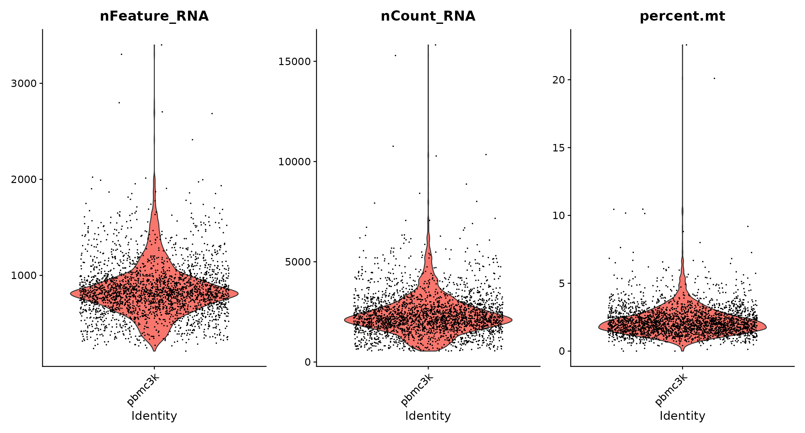

# Analysis Using Seurat {#downstream}

In this tutorial, we will learn how to `Read 10X sequencing data and change it into a seurat object`, `Standard pre-processing workflow`, `QC and selecting cells for further analysis`, `Create an ‘integrated’ data assay from data coming from two samples`, `Normalizing the data`, `Identification of highly variable features (feature selection)`, `Scaling the data`, `Perform linear dimensional reduction` and `Cluster the cells`.

Data used here are samples of human immune cells (PBMC) in either [a resting or interferon-stimulated state](https://www.nature.com/articles/nbt.4042).

## Seurat object

```{r, warning=FALSE, message=FALSE}
library(Seurat)
library(SeuratData)
library(patchwork)
library(tidyverse)
```

## Setup the Seurat object

We start by reading in the data. The `Read10X()` function reads in the output of the cellranger pipeline from 10X, returning a unique molecular identified (UMI) count matrix. The values in this matrix represent the number of molecules for each feature (i.e. gene; row) that are detected in each cell (column).

We next use the count matrix to create a `Seurat` object. The object serves as a container that contains both data (like the count matrix) and analysis (like PCA, or clustering results) for a single-cell dataset. For a technical discussion of the Seurat object structure, check out our [GitHub Wiki](https://github.com/satijalab/seurat/wiki).

The sameple in `GSM2560248` is the control group which is human immune cells (PBMC) in a resting state, while the sameple in `GSM2560249` is the human immune cells (PBMC) in a interferon-stimulated state.

```{r, message=FALSE, warning=FALSE}
data_dir1 = "./data/Exp6_Kang/GSM2560248"
expression_matrix1 <- Read10X(data.dir = data_dir1)
ctrl = CreateSeuratObject(counts = expression_matrix1)
ctrl = AddMetaData(object = ctrl, metadata = rep("ctrl", dim(ctrl)[2]), col.name = 'sample')

data_dir2 = "./data/Exp6_Kang/GSM2560249"
expression_matrix2 <- Read10X(data.dir = data_dir2)
stim = CreateSeuratObject(counts = expression_matrix2)
stim = AddMetaData(object = stim, metadata = rep("stim", dim(stim)[2]), col.name = 'sample')
```

## Standard pre-processing workflow

The steps below encompass the standard pre-processing workflow for scRNA-seq data in Seurat. These represent the selection and filtration of cells based on QC metrics, data normalization and scaling, and the detection of highly variable features.

### QC and selecting cells for further analysis

Seurat allows you to easily explore QC metrics and filter cells based on any user-defined criteria. A few QC metrics commonly used by the community include

* The number of unique genes detected in each cell.
  + Low-quality cells or empty droplets will often have very few genes
  + Cell doublets or multiplets may exhibit an aberrantly high gene count
  + Similarly, the total number of molecules detected within a cell (correlates strongly with unique genes)
* The percentage of reads that map to the mitochondrial genome
  + Low-quality / dying cells often exhibit extensive mitochondrial contamination
  + We calculate mitochondrial QC metrics with the PercentageFeatureSet() function, which calculates the percentage of counts originating from a set of features
  + We use the set of all genes starting with MT- as a set of mitochondrial genes
  
```{r}
# The [[ operator can add columns to object metadata. This is a great place to stash QC stats
ctrl[["percent.mt"]] <- PercentageFeatureSet(ctrl, pattern = "^MT-")
stim[["percent.mt"]] <- PercentageFeatureSet(stim, pattern = "^MT-")
```

The number of unique genes and total molecules are automatically calculated during `CreateSeuratObject()`. They are stored in the object meta data.

```{r}
# Show QC metrics for the first 5 cells in the control group
head(ctrl@meta.data, 5)
```

We can visualize the `nFeature_RNA`, `nCount_RNA` and `percent.mt` we used for QC metrics

```{r}
# Visualize QC metrics as a violin plot
VlnPlot(ctrl, features = c("nFeature_RNA", "nCount_RNA", "percent.mt"), ncol = 3, pt.size = 0.00001)
```

In this data, we the reads counts of mitochondrial genes are zero, thus the `percent.mt` is zero for all cells.

```{r}
mtgenes = grep("^MT-", rownames(ctrl[["RNA"]]),value = T)
ctrl@assays$RNA[mtgenes,] %>% as.matrix() %>% rowSums()
```

If reads counts of mitochondrial genes are not equal to zero, we might get a plot look like this.

```{r qc, out.width='100%', fig.align='center', echo=FALSE}

```

We can then using dot plot to show the relationship between `nCount_RNA` and `nFeature_RNA`.

```{r}
# FeatureScatter is typically used to visualize feature-feature relationships, but can be used
# for anything calculated by the object, i.e. columns in object metadata, PC scores etc.

FeatureScatter(ctrl, feature1 = "nCount_RNA", feature2 = "nFeature_RNA")
```

Here, we filter cells that have unique feature counts over 2,000 or less than 300

```{r}
ctrl <- subset(ctrl, subset = nFeature_RNA > 300 & nFeature_RNA < 2000)
stim <- subset(stim, subset = nFeature_RNA > 300 & nFeature_RNA < 2000)
# We can also do the filtering based on percent.mt
# ctrl <- subset(ctrl, subset = percent.mt < 5)
```

```{r}
p1 = VlnPlot(ctrl, features = c("nFeature_RNA", "nCount_RNA"), ncol = 3, pt.size = 0.00001)
p2 = FeatureScatter(ctrl, feature1 = "nCount_RNA", feature2 = "nFeature_RNA") + theme(axis.text.x = element_text(angle = 45, vjust = 0.5, hjust=1))
p1 + p2
```

### Normalizing the data

After removing unwanted cells from the dataset, the next step is to normalize the data. By default, we employ a global-scaling normalization method “LogNormalize” that normalizes the feature expression measurements for each cell by the total expression, multiplies this by a scale factor (10,000 by default), and log-transforms the result. Normalized values are stored in `object[["RNA"]]@data`.

```{r}
ifnb.list <- c(ctrl = ctrl, stim = stim)

ifnb.list <- lapply(X = ifnb.list, FUN = function(x) {
    x <- NormalizeData(x, normalization.method = "LogNormalize", scale.factor = 10000)
})
```

For clarity, in this previous line of code (and in future commands), we provide the default values for certain parameters in the function call. However, this isn’t required and the same behavior can be achieved with:

```{r, eval=FALSE}
x <- NormalizeData(x)
```

### Identification of highly variable features (feature selection)

We next calculate a subset of features that exhibit high cell-to-cell variation in the dataset (i.e, they are highly expressed in some cells, and lowly expressed in others). We and [others](https://www.nature.com/articles/nmeth.2645) have found that focusing on these genes in downstream analysis helps to highlight biological signal in single-cell datasets.

Our procedure in Seurat is described in detail [here](https://www.sciencedirect.com/science/article/pii/S0092867419305598?via%3Dihub), and improves on previous versions by directly modeling the mean-variance relationship inherent in single-cell data, and is implemented in the `FindVariableFeatures()` function. By default, we return 2,000 features per dataset. These will be used in downstream analysis, like PCA.

```{r}
ifnb.list <- lapply(X = ifnb.list, FUN = function(x) {
    x <- FindVariableFeatures(x, selection.method = "vst", nfeatures = 2000, verbose = FALSE)
})

# Identify the 10 most highly variable genes
top10 <- head(VariableFeatures(ifnb.list$ctrl), 10)

# plot variable features with and without labels
plot1 <- VariableFeaturePlot(ifnb.list$ctrl)
LabelPoints(plot = plot1, points = top10, repel = TRUE, max.overlaps = 30)
```

```{r}
# select features that are repeatedly variable across datasets for integration
features <- SelectIntegrationFeatures(object.list = ifnb.list)
```

## Perform integration

`Scaling the data` is 

We then identify anchors using the `FindIntegrationAnchors()` function, which takes a list of Seurat objects as input, and use these anchors to integrate the two datasets together with `IntegrateData()`.

```{r, eval=FALSE}
immune.anchors <- FindIntegrationAnchors(object.list = ifnb.list, anchor.features = features)
# this command creates an 'integrated' data assay
immune.combined <- IntegrateData(anchorset = immune.anchors)

# specify that we will perform downstream analysis on the corrected data note that the
# original unmodified data still resides in the 'RNA' assay
DefaultAssay(immune.combined) <- "integrated"
```

The above step will take around 10 minutes. To save time, let's load the processed data directory.

```{r}
load("./data/immune.combined.Rdata")
```

## Scaling the data

Next, we apply a linear transformation (‘scaling’) that is a standard pre-processing step prior to dimensional reduction techniques like PCA. The ScaleData() function:

Shifts the expression of each gene, so that the mean expression across cells is 0
Scales the expression of each gene, so that the variance across cells is 1
This step gives equal weight in downstream analyses, so that highly-expressed genes do not dominate
The results of this are stored in pbmc[["RNA"]]@scale.data

```{r}

```

