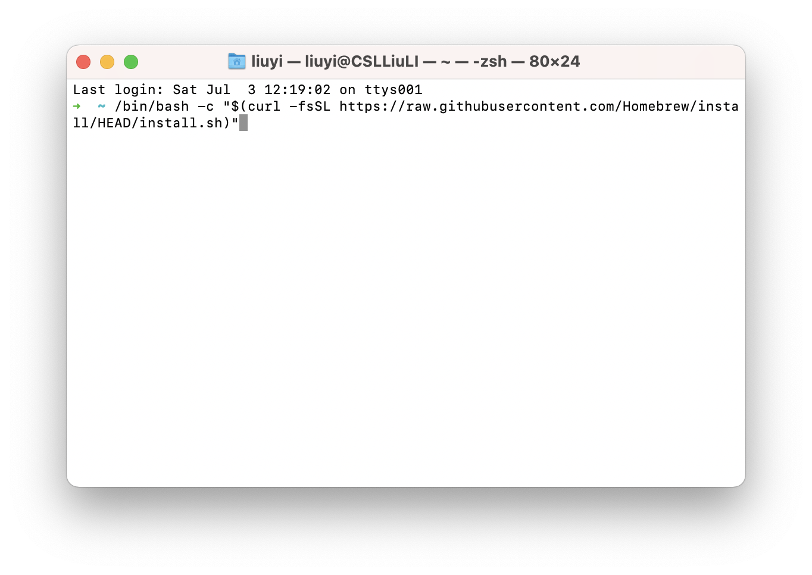
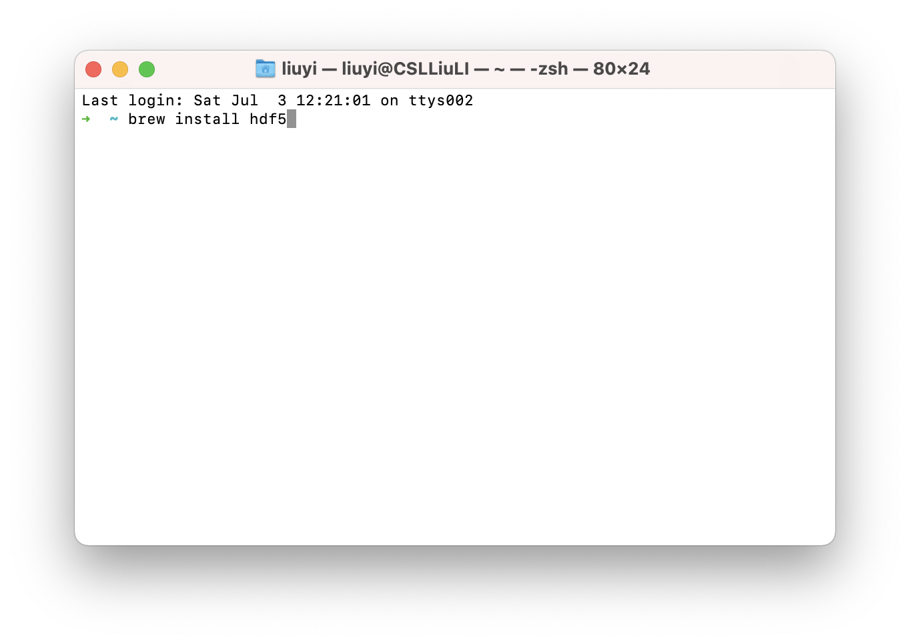
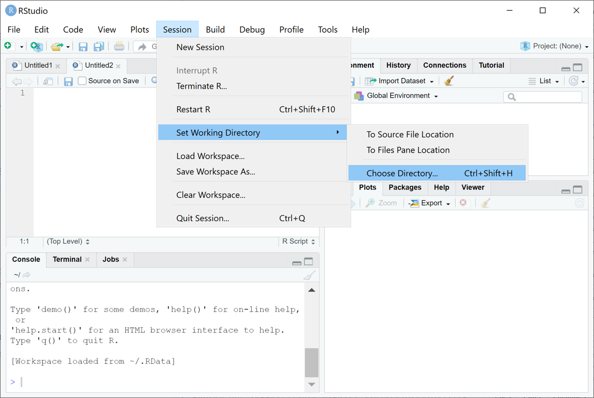
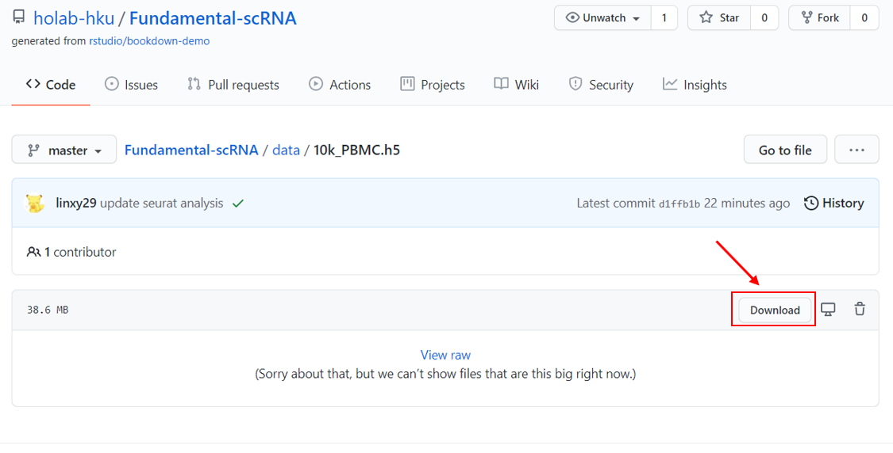
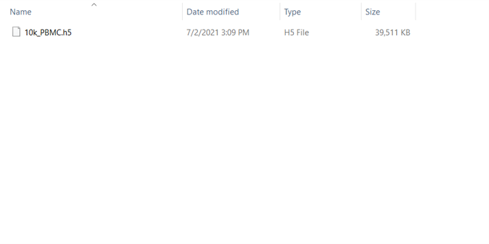

--- 
title: "Fundamentals of scRNASeq Analysis"
author: "Xinyi Lin, Gordon Qian, Joshua Ho contact: jwkho@hku.hk"
institute: "Contact: Ho Lab, HKU"
date: "2021-06-28 (updated: `r Sys.Date()`)"
site: bookdown::bookdown_site
output: bookdown::gitbook
documentclass: book
bibliography: [book.bib, packages.bib]
biblio-style: apalike
link-citations: yes
github-repo: linxy29/Fundamental-scRNA
description: "This is the teaching materials for Session 2: Fundamentals of scRNASeq Analysis of 2021 Single Cell Workshop"
---

# Prerequisites {-}

This is the teaching material for **Session 2: Fundamentals of scRNASeq Analysis** of **2021 Single Cell Workshop**.

### Install packages {-}

Some packages used in this material can be installed from CRAN:

```{r, eval=FALSE}
install.packages('Seurat')
install.packages("patchwork")
install.packages("dplyr")
install.packages("ggplot2")
```

The R package `hdf5r` is also needed. For `Windows` user, you can simply install it from CRAN:

```{r, eval=FALSE}
install.packages('hdf5r')
```

For `Mac` user:

1. open the `Terminal` application and type following `two` commands one by one:

```{r, eval=FALSE}
/bin/bash -c "$(curl -fsSL https://raw.githubusercontent.com/Homebrew/install/HEAD/install.sh)"

brew install hdf5
```

```{r hdf5r, out.width='80%', fig.align='center', echo=FALSE}


```

* If you got the error `command not found`, you might need to add an extra command. In another word, instead of previous two command, you should type following `three` commands one by one:

```{r, eval=FALSE}
/bin/bash -c "$(curl -fsSL https://raw.githubusercontent.com/Homebrew/install/HEAD/install.sh)"

echo "export PATH=/opt/homebrew/bin:$PATH" >> ~/.bash_profile && source ~/.bash_profile

brew install hdf5
```

2. open your R studio and install the R package `hdf5r` from CRAN:

```{r, eval=FALSE}
install.packages('hdf5r')
```

### Set working directory {-}

Setting a working directory first helps us read and save data in an easier way. To set a working directory:

* create a folder named “R-workshop” in your preferred directory

* create a “data” folder in the `R-workshop`

* from RStudio, use the menu to change your working directory under Session > Set Working Directory > Choose Directory

* choose the directory to `R-workshop`

```{r workpath, out.width='80%', fig.align='center', echo=FALSE}

```

Or you can type in the console:
```
setwd("/yourdirectory/R-workshop")
```
For Windows, the command might look like :
```
setwd("c:/yourdirectory/R-workshop")
```

### Download data {-}

Data used in this material is a 10k PBMC data getting from [10x Genomics website](https://support.10xgenomics.com/single-cell-gene-expression/datasets). 

To prepare data for this workshop:

* download the `10k_PBMC.h5` from: https://github.com/holab-hku/Fundamental-scRNA/blob/master/data/10k_PBMC.h5

```{r data1, out.width='80%', fig.align='center', echo=FALSE}

```

* put it in the `data` folder we create before.

* the `data` folder should be look like this:

```{r data2, out.width='80%', fig.align='center', echo=FALSE}

```

```{r include=FALSE}
# automatically create a bib database for R packages
knitr::write_bib(c(
  .packages(), 'bookdown', 'knitr', 'rmarkdown', 'Seurat', 'patchwork', 'dplyr', 'ggplot2'
), 'packages.bib')
```

<br/>

#### Acknowledgement {-}

Thanks everyone in [Ho Lab](https://holab-hku.github.io/) who gives great comments/suggestions and contributes to this teaching material.

#### Other modules of this workshop {-}

Module 1: Introduction to R by Dr Joshua Ho & lab [Online tutorials](https://holab-hku.github.io/R-workshop/)

This is the Module 2: Fundamentals of scRNA-seq analysis by Dr Joshua Ho

Module 3: Cell clustering and annotation by Dr Asif Javed [Online tutorials](https://github.com/pkuerten/single_cell_clustering_annotation.github.io/blob/main/index.md)

Module 4.1: Cell interaction by Dr Asif Javed [Online tutorials](https://github.com/pkuerten/single_cell_interaction.github.io/blob/main/index.md)

Module 4.2 & Module 5: Cell trajectory inference & Cellular genetic analysis by Dr Yuanhua Huang [Online tutorials](https://statbiomed.github.io/SingleCell-Workshop-2021/)
